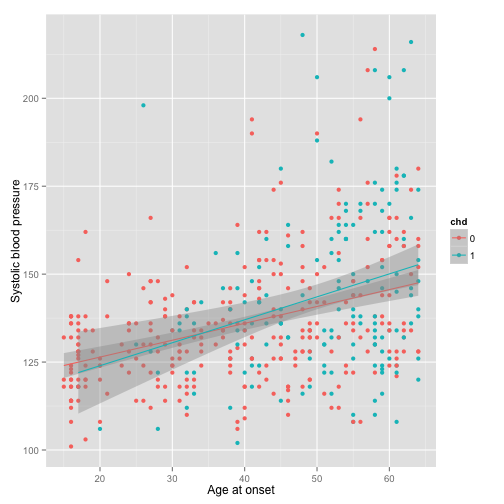

Hearth Disease Data: Shiny App
========================================================
author: Tymon
date: 22 March 2015
font-family: 'Arial'

Introduction and Heart Disease Data
========================================================

The application available at the [ShinyApps](https://transgred.shinyapps.io/Coursera-Heart_Disease_Data_App/) portal is a simple web app designed as a part of the Coursera module "Developing Data Products".

Data set (available as SAheart in R) contains 10 variables collected from 462 cases and is part of the [ElemStatLearn](http://www.inside-r.org/packages/cran/ElemStatLearn/docs/SAheart) package.

Each variable is a specific risk factor which may contribute to the development of the coronary heart disease.

The applications allows users to combine three different variables in one chart and perform basic exploratory analysis with additional help of regression lines (either linear or non-linear).

Application UI
========================================================
The user interface is very simple and contains four widgets for options selection.
First drop-down menu selects variables for x-axis, second for y-axis. 

The 'Group by' menu controls selection of variable by which the cases on the chart will be broken down.

Last widget - two radio buttons - control type of regression used for drawing the smoothed line over the chart. Users can choose between linear model or Local Polynomial Regression Fitting (Loess).

 

R code for chart
========================================================
The code for chart plotting uses ggplot engine. The 'chd' variable is converted to the factor type. By default it comes as integer, howewer it is a binomial variable only with 0 and 1 to indicate presence (or lack) of coronary heart disease. In this example the smoothing is calculated using linear regression.

Sample chart is available on the next slide.


```r
library(ElemStatLearn)
library(ggplot2)
SAheart$chd <- as.factor(SAheart$chd)
q <- qplot(data = SAheart, x = age, y = sbp, col = chd) + stat_smooth(method = "lm") + labs(x = "Age at onset", y = "Systolic blood pressure")
```

Sample graph and basic analysis
========================================================

<small>Graph generated with the code from previous slide shows possible relationship between blood pressure, onset age and coronary heart disease.
As the age increases, there is also increase of blood pressure and slight increase in the risk of coronary heart disease.</small>
 
